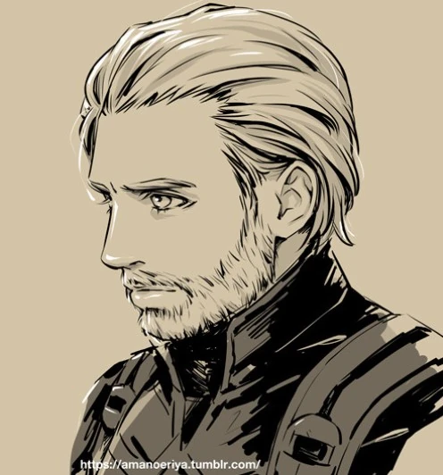

**Daniel** é um meio-elfo paladino. Ele foi criado e é controlado pelo jogador Zille.

## Descrição

### Aparência
Daniel é um adulto de belo porte físico e aparência. O paladino possui cabelos loiros e mantém a barba cheia. Devido ao árduo trabalho de aventureiro ele carrega consigo seu escudo e martelo e usa roupas simples por baixo de sua armadura propositalmente à mostra.

#### Detalhes
* Cabelo: Loiro
* Olhos: Azuis
* Etnia: Caucasiano

### Personalidade
Sempre atento, Daniel procura extrair o melhor daqueles ao seu redor. Buscando propagar a bondade, o paladino ajuda aqueles que considera necessitados e está sempre aberto à uma conversa sensata para a resolução de conflitos.

Apesar de seu comportamento humilde e calmo Daniel é ocasionalmente dirigido pelas próprias emoções quando situações que remetem problemas de seu passado são trazidas à tona. O juramento de vingança feito por ele através de seu padroeiro [[Bahamut]] é levado veemente à serio quando o paladino está na presença de qualquer maldade ou injustiça que possa de alguma forma prejudicar seus amigos ou pessoas inocentes.

## História

<figure class="wiki-figure wiki-align-left"></figure>

### Passado
*"Daniel. Órfão. Não conheceu suas origens, seus pais ou parentes de sangue, sua terra se tornou o chão que pisava, que dormia, que caçava e que sustentava seu corpo na incessante luta pela sobrevivência de cada dia. Desde muito novo, foi acolhido por um grupo de viajantes e aventureiros, eremitas que, tal como ele, sobreviviam e se acolhiam em busca de uma vida melhor. Todos lá se ajudavam como uma grande família, uma que Daniel não teve o prazer de conhecer antes, e a tribo sempre crescia, se abria aos necessitados de bom coração, que se dispunham a fazer parte da mesma, à medida que se deslocava em busca de terrenos prósperos e de paz. Eram muitos que se abrigavam nos braços da luta pela sobrevivência, e tantos distintos, homens e mulheres refugiados, crianças e velhos abandonados, viajantes, uns perdidos e outros não, contadores de histórias, fazendeiros que tiveram as posses retiradas pela a tirania dos reis ou a vilania dos ladrões, trabalhadores dos mais variados tipos, simpatizantes e pessoas dispostas a ajudar também, guerreiros e batalhadores, alguns impactados por terríveis guerras que nada têm a ver com o seu sofrimento ou conflitos injustos, mas todos encontravam ali um lugar.*

*Duas décadas se passaram e Daniel acompanhou a formação daquela grande família e da consolidação da esperança de continuar conquistando uma vida melhor. Nem todos lá compartilhavam as mesmas crenças e costumes, mas era certo de que os deuses foram muito generosos durante esse tempo. Depois de muitas transições a tribo finalmente se estabeleceu nas terras próximas ao [[Reino de Kamorath]]. Foram muitos meses de tranquilidade e Daniel encontrou ali seu lar e sua família, quase uma centena de pessoas e todos se conheciam, muitos amigos, que se cuidavam, colaboravam, que cultivavam da terra ou caçavam na natureza o sustento de todos, que construíam suas casas, seus lares, que tratavam dos doentes e fortaleciam seu espírito.*

*Tudo ocorria bem até uma noite atipicamente escura e não estrelada, quando o céu se tornou um completo breu e o pouco que as fogueiras e lampiões iluminavam não permitia nem enxergar um palmo para dentro da floresta mais próxima, o silêncio tomou conta das conversas e afazeres de todos na tribo permitindo ouvir a chegada de um infortúnio. Incontáveis e monstruosas trotadas que vinham de trás das árvores, cada vez mais e mais altas, se aproximando velozmente e transpassando sua fúria e sangue. Todos pressentiram o perigo instintivamente e o que se tornou silêncio se volveu novamente para barulho, mas dessa vez de vozes aflitas e se preparando para o que podia estar por vir. Todos que podiam proteger aquele lar se juntaram com algumas armas e ferramentas na direção da floresta, em questão de segundos, transbordando adrenalina e medo. Cada vez mais alto impossibilitando de ouvir qualquer outra coisa o som das trotadas foi aumentando até que, subitamente das sombras penumbrais, surgiram dezenas de cavaleiros montados em corcéis negros e de armaduras medonhas igualmente negras, olhas vermelhos e pequenos que fugiam dos capacetes como luzes vazias do inferno e imensas lanças de ébano. Surgiram em investida e direcionando um ataque nos inocentes moradores da tribo. Um massacre proclamado pela crueldade. Depois da primeira dezena, mais outra surgiu logo atrás, seguida de outra e mais outra, cessando as aparições somente depois da matança ser concluída.*

*Talvez alguns tenham fugido a tempo, alguns se escondido, alguns poucos, mas Daniel se concentrou em defender aquilo que tanto importava para ele e para todos ali. E em meio a luta, vendo seus amigos e companheiros terem as vidas tiradas pela maldade, mal percebeu a fria lâmina de ébano perfurar o canto de sua barriga até cair no chão sem forças e desacordado. Desmaiando e desfalecendo, o rapaz balbuciou algumas palavras, sussurrou sem que alguém pudesse ouvir, clamando aos deuses por justiça e misericórdia. Os barulhos do conflito ecoavam em seus ouvidos, gritos, choros, lamentos e o tinir do aço, cada vez mais baixos e distantes, até finalmente perder a consciência.*

*Imerso na escuridão e no vazio profundo, não sentia o próprio corpo, mas sim a imensidão do completo nada, como se alguma coisa que fosse seu espírito flutuasse em um oceano de tamanho infinito e de águas negras. Pesando cada vez mais, afundando cada vez mais sentindo as águas que o envolviam cada vez mais frias e escuras. Naquele instante, Daniel percebeu que era o fim e lembrou da vida que teve com todos os seus companheiros, das lutas individuais de cada um e das batalhas árduas que tiveram juntos em busca da prosperidade e da paz, lembrou do longo caminho que trilharam juntos e, indignado com o triste e cruel fim daqueles sonhos, amaldiçoou toda a maldade e injustiça do mundo ao ponto de sacrificar seu espírito para mudá-lo.*

*Transbordando seus ânimos e já distante da superfície daquele oceano, foi surpreendido por um ponto de forte luminosidade vindo de cima, chamando e puxando seu “corpo” para sua direção e para longe da escuridão. Ao submergir acordou eufórico e sem saber onde estava. Confuso e atônito, indagando-se sobre a espiritualidade daquele lugar, parou por alguns segundos para observar a sala de madeira ao seu redor, bem iluminada pela luz do sol e com algumas tapeçarias sobre móveis que se assemelhavam a camas, poucos metros depois, oposto à porta de entrada, um singelo altar onde se encontrava uma estátua de [[Pelor]] cercada por flores.*

*Pouco antes de se levantar, um homem mais velho adentrou a sala pela única porta existente no lugar. Ele se aproximou e explicou à Daniel que ali era um templo sagrado em devoção aos deuses bondosos, que seus membros peregrinavam para longe com a intenção de ajudar os mais necessitados e que em uma dessas jornadas, não muito distante dali, encontraram o local de sua antiga tribo e o rapaz caído no chão quase sem vida. Eles realizaram um ritual de descanso para os seus companheiros mortos, cremaram os corpos e trouxeram Daniel para o templo.*

*Daniel foi tratado e passou alguns dias naquele lugar até se recuperar, colaborou e agradeceu ao tempo e aos bons samaritanos que ali o ajudaram. Com um pouco mais de forças ele voltou ao local onde descansavam seus falecidos companheiros, de luto e em prantos, tomou para si toda a vontade de fazer do mundo um lugar onde os inocentes pudessem buscar sua felicidade sem sofrer nas mãos da injustiça. Ele encontrou alguns pedaços de armadura, algumas placas de aço ainda restantes, lembranças da história que viveu, se arrumou e seguiu em busca daquelas e de outras forças malignas que pudessem assombrar o mundo.*

*Depois de muito tempo, pouco se ouviu sobre a maligna e sombria esquadra de cavaleiros negros que vagavam pelo mundo massacrando e abusando dos inocentes. Mesmo tentando persegui-los, juntando forças, procurando rastros e pistas, a existência daquele grupo simplesmente desapareceu sem pagar pelos pecados cometidos ao longo de tantos anos. Ainda assim, Daniel continuou procurando-os para saldarem seu débito com a justiça, e procurando tantas outras injustiças que assolavam os caminhos do Paladino."*

### Pré-jogo
Outra década se passou e recentemente Daniel ficou sabendo de casos onde moradores inocentes de pequenas vilas na região sul de [[Altoriel]] estavam sendo vendidos como escravos por um grupo de bandidos que os subjugaram forçadamente. A fim de combater essa injustiça Daniel aceitou trabalhar para a [[Caravana de Edmund]] que tem como área de atuação essa mesma região. Lá, o paladino acabou conhecendo [[Eryn Montreal]] e [[Sinbad]].

### [[Parte 1: Adentrando a Escuridão]]
Após o incidente da [[Caravana de Edmund]] Daniel passou a se envolver ativamente nos problemas que circundam a [[Vila do Dente Quebrado]]. Formando uma forte aliança com os aventureiros que mais tarde se tornariam o grupo conhecido como [[A Mão]], o paladino focou seus esforços em desvendar os mistérios da caixa de [[Edmund]] e descobrir pistas que pudessem direcioná-lo aos responsáveis pelos crimes do seu passado.

Daniel conheceu [[Toisan]], um mago e bibliotecário formado pela [[Academia Prisinger]] em [[Reino de Kamorath|Kamorath]], e viu nele uma grande oportunidade para entender os mistérios de sua terra natal. Com tarefas mais urgentes à serem resolvidas o meio-elfo teve de adiar a conversa e, antes que pudesse obter informações específicas sobre seu reino e suas organizações, ele recebeu a trágica notícia do assassinato de [[Toisan]].

Mais tarde, após perder os rastros que o levariam até a caixa agora perdida, Daniel, juntamente com seu grupo, iniciou uma jornada até a grande metrópole de [[Lorelheim (Capital)|Lorelheim]] em busca de novos segredos e oportunidades.

## Relações

### [[Carpeado]]
Desde quando se conheceram Daniel e Carpeado mantêm uma relação forte. Valorizando o compromisso do dono para com seu próprio bem estar, o animal parece compartilhar o desejo de permanecerem próximos um do outro. Mesmo sem conhecer o passado do cervo, Daniel imagina que pode possivelmente ter encontrado um aliado para a vida toda.

### [[Hakai]]
Daniel e Hakai se tornaram bem próximos depois que descobriram suas respectivas devoções pelo mesmo deus, [[Bahamut]]. A confiança dos dois com relação ao outro cresceu consideravelmente e continua forte, principalmente após Daniel salvar a vida de Hakai algumas vezes durante o incidente na [[Caverna do Clérigo]]. Durante suas aventuras Hakai costuma referir-se à Daniel em suas piadas através de frases como "Na luta eu vou ficar atrás dele." ou "Eu devo tudo à esse paladino!".

### [[Marduk]]
Daniel e Marduk possuem uma relação de confiança mútua. Quando se encontraram após os ataques à [[Caravana de Edmund]], os dois viram um no outro um compromisso com as promessas que fizeram para as outras pessoas, o que resultou rapidamente numa relação de respeito.

## Informações

#### Habilidades
* Estilo de Luta - Proteção
* Juramento Sagrado - Juramento de Vingança

#### Magias de Paladino

##### **Juramento da Vingança**
* Marca do Caçador
* Perdição

##### **1º Nível**
* Curar Ferimentos
* Heroísmo

## Trivia
* O personagem Daniel teve seu nome e classe inspirados pelo vídeo "[Daniel paladino na minha frente em Edron!](https://www.youtube.com/watch?v=8jmKSFBW3zY)".
* A aparência de Daniel foi inspirada no personagem fictício Capitão América. Zille percebeu as semelhanças entre os dois personagens (compromisso com a bondade e a justiça e ambos usarem um escudo e um martelo) e optou por dar a Daniel a mesma aparência do herói.
** Essas semelhanças contribuíram para a escolha do nome Vingadores pelos jogadores.

## Referências
